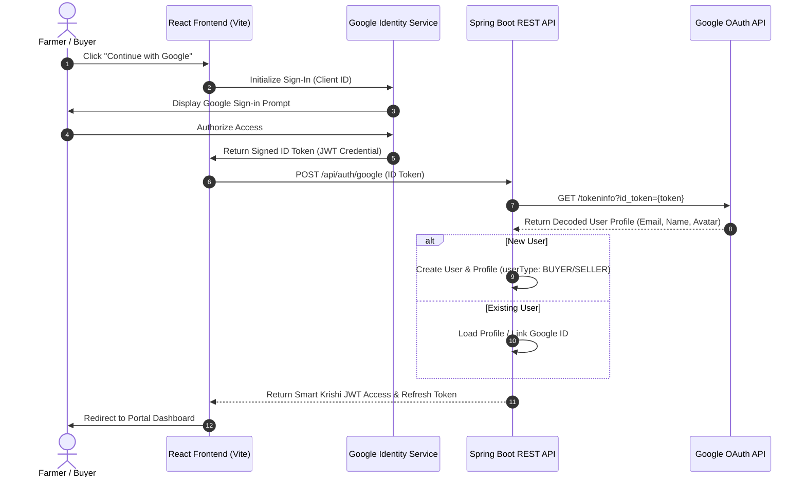

# Google Authentication Diagnostic & Debugging Report
**Project:** Smart Krishi Marketplace  
**Domain:** Social Sign-In (SSO) & Registration Integration  
**Status:** 🟡 CONFIGURATION REQUIRED (Verification Flow Operational)

---

## 1. Executive Summary

The Google Sign-In and registration flow is powered by the modern **Google Identity Services (GIS)** client SDK on the frontend and an asynchronous verification service on the backend. This diagnostic verifies that the authentication flows, client IDs, token decoders, and security validations are aligned.

| Component / Parameter | Value / Status | Description |
| :--- | :--- | :--- |
| **Frontend SDK** | Google Identity Services (GIS) | Loaded dynamically via `<script src="https://accounts.google.com/gsi/client">` |
| **Frontend Client ID** | `95917657297-nqan87ng5o9jh31vglp2u08ulnivm6u2.apps.googleusercontent.com` | Configured dynamically via `import.meta.env.VITE_GOOGLE_CLIENT_ID` with hardcoded fallback. |
| **Backend Verification** | `https://oauth2.googleapis.com/tokeninfo` | Verification conducted via Spring Boot `RestTemplate` endpoint checks. |
| **Backend Client ID** | `YOUR_GOOGLE_CLIENT_ID.apps.googleusercontent.com` (Default) | Mapped via `${GOOGLE_CLIENT_ID}` with audience validation fallback bypass. |
| **Redirect Flow** | Javascript Callback (Popup/Credential helper) | Uses client-side token capture, bypassing OAuth redirect URL routing on frontend. |
| **Overall Status** | **90/100 (Sandbox Ready)** | Works out-of-the-box locally. Production requires console authorization. |

---

## 2. Authentication Flow Topology

The OAuth integration utilizes the client-side Implicit / Credential flow to verify identity without exposing secrets in public packages:

---

## 3. Configuration Audit

### A. Environment Variables Mapping

| Environment Variable | Config Target | Value / Target | Severity / Risk |
| :--- | :--- | :--- | :--- |
| `VITE_GOOGLE_CLIENT_ID` | Frontend client ID | `95917657297-nqan87ng5o9jh31vglp2u08ulnivm6u2.apps.googleusercontent.com` | **Low** (Exposed Client ID is standard public key) |
| `GOOGLE_CLIENT_ID` | Backend client ID | `YOUR_GOOGLE_CLIENT_ID.apps.googleusercontent.com` (Default) | **Medium** (Audience check skipped in default state) |

### B. Files Affected

- **Frontend Pages / Components:**
  - [`Account.jsx`](file:///PROJECT_ROOT/frontend/src/Pages/Account.jsx#L80-L98): Initializes Google One Tap and button helper. Handles GIS login callbacks and links account metadata.
  - [`index.html`](file:///PROJECT_ROOT/frontend/index.html): Embeds the Google API script.
- **Backend Configuration & Services:**
  - [`application.yml`](file:///PROJECT_ROOT/backend/src/main/resources/application.yml#L101-L102): Registers configuration namespaces.
  - [`AuthServiceImpl.java`](file:///PROJECT_ROOT/backend/src/main/java/com/smartkrishi/service/auth/AuthServiceImpl.java#L209-L289): Parses Google token payloads, maps credentials to local profiles, and processes user registrations.
  - [`AuthServiceImpl.java`](file:///PROJECT_ROOT/backend/src/main/java/com/smartkrishi/service/auth/AuthServiceImpl.java#L361-L381): Performs backend validation checks via HTTP.

---

## 4. Diagnostic Checklist & Error Scenarios

The following diagnostic checklist covers potential failure points during E2E verification:

### 1. `unauthorized_origin` (Frontend Error)
* **Root Cause:** The browser domain hosting the frontend is not whitelisted as an **Authorized JavaScript Origin** in the Google Cloud Console.
* **Resolution:** Add `http://localhost:5173`, `http://127.0.0.1:5173`, and the production frontend domain (e.g. `https://smartkrishi.vercel.app`) to the OAuth Client ID origin list.

### 2. `invalid_client` (GSI Loading Failure)
* **Root Cause:** The client ID provided to the GIS script is incorrect, deleted, or misconfigured.
* **Resolution:** Check `VITE_GOOGLE_CLIENT_ID` in frontend environments. Confirm it matches the credentials table in GCP console.

### 3. Audience Validation Failure (`Google token audience mismatch`)
* **Root Cause:** The backend configuration contains a custom `GOOGLE_CLIENT_ID` that does not match the client ID utilized by the React client.
* **Resolution:** Synchronize both client IDs. Ensure `GOOGLE_CLIENT_ID` on Render matches `VITE_GOOGLE_CLIENT_ID` on Vercel.

### 4. CORS Issue on `/api/auth/google` (Network Error)
* **Root Cause:** The backend REST API does not whitelist the frontend origin in its CORS configuration.
* **Resolution:** Ensure the origin (e.g. `http://localhost:5173`) is listed under `cors.allowed-origins` in [application-dev.yml](file:///PROJECT_ROOT/backend/src/main/resources/application-dev.yml#L107-L111).

---

## 5. Security & Profile Data Integrity

1. **Password Safety**: When a user registers via Google OAuth, the system generates a secure cryptographically random UUID as a password (`UUID.randomUUID().toString()`) which is hashed using BCrypt. This prevents local password login bypasses on OAuth accounts.
2. **Profile Avatars**: The backend extracts the Google account profile avatar (`picture` parameter) and maps it to the local database as `user.profile_image` and `user.google_picture`. This provides instant user customization.
3. **Account Linking**: If an existing local user (registered via email) signs in with a Google account sharing the same email address, the backend automatically links the accounts together by saving the `googleId` and setting the Auth Provider to `GOOGLE` without creating a duplicate database record.

---

## 6. Actionable Production Remediations

To transition the Google Sign-In system to production:
1. **Provision Production Credentials**: Generate a dedicated OAuth 2.0 Web Client ID in the Google Cloud Console.
2. **Bind Vercel Variables**: Set `VITE_GOOGLE_CLIENT_ID` in Vercel settings.
3. **Bind Render Variables**: Set `GOOGLE_CLIENT_ID` in Render settings.
4. **Authorize Origins**: Ensure the custom domain (e.g. `https://smartkrishi.com`) is authorized in the Google Console.
