# Smart Krishi - Entity Relationship Diagram (ER)

```mermaid
erDiagram
    USERS ||--o{ USER_ROLES : has
    USERS ||--o{ LOGIN_HISTORY : logs
    USERS ||--o{ SESSIONS : maintains
    USERS ||--o{ DEVICES : uses
    USERS ||--o{ OTP_VERIFICATIONS : requests
    USERS ||--o{ PASSWORD_RESETS : requests
    
    USERS ||--o{ BUYER_PROFILES : has
    USERS ||--o{ SELLER_PROFILES : has
    USERS ||--o{ USER_ADDRESSES : has
    USERS ||--o{ USER_DOCUMENTS : uploads
    USERS ||--o{ KYC_VERIFICATIONS : undergoes
    USERS ||--o{ PROFILE_PHOTOS : has
    
    SELLER_PROFILES ||--o{ SELLER_BUSINESS_INFO : has
    SELLER_PROFILES ||--o{ SELLER_BANK_ACCOUNTS : has
    SELLER_PROFILES ||--o{ SELLER_UPI_ACCOUNTS : has
    SELLER_PROFILES ||--o{ SELLER_RATINGS : has
    SELLER_PROFILES ||--o{ SELLER_ANALYTICS : tracks
    
    CATEGORIES ||--o{ SUBCATEGORIES : contains
    SUBCATEGORIES ||--o{ PRODUCTS : lists
    CATEGORIES ||--o{ CATEGORY_ATTRIBUTES : defines
    
    PRODUCTS ||--o{ PRODUCT_IMAGES : has
    PRODUCTS ||--o{ PRODUCT_VIDEOS : has
    PRODUCTS ||--o{ PRODUCT_SPECS : defines
    PRODUCTS ||--o{ PRODUCT_VARIANTS : has
    PRODUCTS ||--o{ PRODUCT_INVENTORY : tracks
    
    PRODUCTS ||--o{ CROPS : is
    PRODUCTS ||--o{ MACHINERY : is
    PRODUCTS ||--o{ FERTILIZERS : is
    
    SELLER_PROFILES ||--o{ PRODUCTS : sells
    SELLER_PROFILES ||--o{ LAND_LISTINGS : offers
    
    LAND_LISTINGS ||--o{ LAND_SOIL_INFO : has
    LAND_LISTINGS ||--o{ LAND_WATER_INFO : has
    LAND_LISTINGS ||--o{ LAND_OWNERSHIP : has
    LAND_LISTINGS ||--o{ LAND_DOCUMENTS : has
    
    USERS ||--o{ WISHLISTS : has
    USERS ||--o{ CART_ITEMS : maintains
    USERS ||--o{ SEARCH_HISTORY : searches
    
    PRODUCTS ||--o{ PRODUCT_RECOMMENDATIONS : recommended_as
    CATEGORIES ||--o{ TRENDING_PRODUCTS : trends_in
    
    USERS ||--o{ ORDERS : places
    SELLER_PROFILES ||--o{ ORDERS : fulfills
    ORDERS ||--o{ ORDER_ITEMS : contains
    ORDERS ||--o{ ORDER_HISTORY : tracks
    ORDERS ||--o{ ORDER_TRACKING : monitors
    ORDERS ||--o{ ORDER_CANCELLATIONS : may_have
    ORDERS ||--o{ RETURNS : may_have
    
    PRODUCTS ||--o{ ORDER_ITEMS : contains
    
    ORDERS ||--o{ PAYMENTS : pays_via
    PAYMENTS ||--o{ PAYMENT_TRANSACTIONS : logs
    PAYMENTS ||--o{ REFUNDS : may_have
    
    SELLER_PROFILES ||--o{ SETTLEMENTS : receives
    SELLER_BANK_ACCOUNTS ||--o{ SETTLEMENTS : settles_to
    
    ORDERS ||--o{ SHIPPING_ADDRESSES : ships_to
    ORDERS ||--o{ SHIPMENTS : fulfills
    SHIPMENTS ||--o{ DELIVERY_TRACKING : tracks
    
    PRODUCTS ||--o{ REVIEWS : reviewed_in
    USERS ||--o{ REVIEWS : writes
    REVIEWS ||--o{ REVIEW_IMAGES : has
    
    SELLER_PROFILES ||--o{ SELLER_REVIEWS : receives
    USERS ||--o{ SELLER_REVIEWS : writes
    
    USERS ||--o{ CONVERSATIONS : participates_in
    CONVERSATIONS ||--o{ MESSAGES : contains
    MESSAGES ||--o{ MESSAGE_ATTACHMENTS : has
    
    USERS ||--o{ FARMER_POSTS : creates
    FARMER_POSTS ||--o{ POST_COMMENTS : has
    POST_COMMENTS ||--o{ POST_COMMENTS : replies_to
    FARMER_POSTS ||--o{ POST_ENGAGEMENT : receives
    POST_COMMENTS ||--o{ POST_ENGAGEMENT : receives
    
    USERS ||--o{ NOTIFICATIONS : receives
    USERS ||--o{ GOVERNMENT_SCHEMES : applies_to
    GOVERNMENT_SCHEMES ||--o{ SCHEME_APPLICATIONS : accepts
    
    USERS ||--o{ COMPLAINTS : files
    COMPLAINTS ||--o{ DISPUTE_RESOLUTIONS : resolved_by
    
    USERS ||--o{ AUDIT_LOGS : performs
```



## Detailed Relationship Mappings

### 1-to-Many Relationships
```
USERS (1) ──── (M) LOGIN_HISTORY
USERS (1) ──── (M) SESSIONS
USERS (1) ──── (M) DEVICES
USERS (1) ──── (M) OTP_VERIFICATIONS
USERS (1) ──── (M) PASSWORD_RESETS
USERS (1) ──── (M) USER_ADDRESSES
USERS (1) ──── (M) USER_DOCUMENTS
USERS (1) ──── (M) WISHLISTS
USERS (1) ──── (M) CART_ITEMS
USERS (1) ──── (M) SEARCH_HISTORY
USERS (1) ──── (M) ORDERS (as buyer)
USERS (1) ──── (M) REVIEWS
USERS (1) ──── (M) SELLER_REVIEWS
USERS (1) ──── (M) CONVERSATIONS
USERS (1) ──── (M) MESSAGES
USERS (1) ──── (M) FARMER_POSTS
USERS (1) ──── (M) NOTIFICATIONS
USERS (1) ──---- (M) COMPLAINTS
USERS (1) ──---- (M) AUDIT_LOGS

SELLER_PROFILES (1) ──── (M) PRODUCTS
SELLER_PROFILES (1) ──── (M) ORDERS (as seller)
SELLER_PROFILES (1) ──---- (M) SELLER_REVIEWS
SELLER_PROFILES (1) ──---- (M) SETTLEMENTS
SELLER_PROFILES (1) ──---- (M) LAND_LISTINGS

CATEGORIES (1) ──── (M) SUBCATEGORIES
CATEGORIES (1) ──── (M) CATEGORY_ATTRIBUTES
CATEGORIES (1) ──---- (M) TRENDING_PRODUCTS
SUBCATEGORIES (1) ──── (M) PRODUCTS

PRODUCTS (1) ──── (M) PRODUCT_IMAGES
PRODUCTS (1) ──── (M) PRODUCT_VIDEOS
PRODUCTS (1) ──── (M) PRODUCT_SPECS
PRODUCTS (1) ──── (M) PRODUCT_VARIANTS
PRODUCTS (1) ──── (M) PRODUCT_INVENTORY
PRODUCTS (1) ──---- (M) PRODUCT_RECOMMENDATIONS
PRODUCTS (1) ──---- (M) REVIEWS
PRODUCTS (1) ──---- (M) ORDER_ITEMS

LAND_LISTINGS (1) ──── (M) LAND_SOIL_INFO
LAND_LISTINGS (1) ──── (M) LAND_WATER_INFO
LAND_LISTINGS (1) ──---- (M) LAND_OWNERSHIP
LAND_LISTINGS (1) ──---- (M) LAND_DOCUMENTS

ORDERS (1) ──── (M) ORDER_ITEMS
ORDERS (1) ──── (M) ORDER_HISTORY
ORDERS (1) ──---- (M) ORDER_TRACKING
ORDERS (1) ──---- (M) ORDER_CANCELLATIONS
ORDERS (1) ──---- (M) RETURNS
ORDERS (1) ──---- (M) SHIPPING_ADDRESSES
ORDERS (1) ──---- (M) SHIPMENTS

PAYMENTS (1) ──---- (M) PAYMENT_TRANSACTIONS
PAYMENTS (1) ──---- (M) REFUNDS

SHIPMENTS (1) ──---- (M) DELIVERY_TRACKING

REVIEWS (1) ──---- (M) REVIEW_IMAGES

CONVERSATIONS (1) ──---- (M) MESSAGES

MESSAGES (1) ──---- (M) MESSAGE_ATTACHMENTS

FARMER_POSTS (1) ──---- (M) POST_COMMENTS
FARMER_POSTS (1) ──---- (M) POST_ENGAGEMENT

POST_COMMENTS (1) ──---- (M) POST_COMMENTS (parent)
POST_COMMENTS (1) ──---- (M) POST_ENGAGEMENT

GOVERNMENT_SCHEMES (1) ──---- (M) SCHEME_APPLICATIONS

COMPLAINTS (1) ──---- (M) DISPUTE_RESOLUTIONS
```

### Many-to-Many Relationships
```
USERS (M) ──── (M) USER_ROLES
  Bridge Table: user_roles (user_id, role_id)

CONVERSATIONS (M) ──── (M) USERS
  Bridge Table: conversation_participants (conversation_id, user_id)
  
ORDERS (M) ──---- (M) SELLER_PROFILES
  Through: ORDER_ITEMS (order_id, seller_id, product_id)
```

### One-to-One Relationships
```
USERS (1) ──── (0..1) BUYER_PROFILES
USERS (1) ──── (0..1) SELLER_PROFILES
USERS (1) ──── (0..1) KYC_VERIFICATIONS
ORDERS (1) ──---- (1) PAYMENTS
```

## Relationship Cardinality Summary

| From Table | To Table | Cardinality | Notes |
|------------|----------|-------------|-------|
| users | login_history | 1:M | One user logs in many times |
| users | sessions | 1:M | One user may have multiple active sessions |
| users | orders | 1:M | One buyer places many orders |
| seller_profiles | products | 1:M | One seller lists many products |
| seller_profiles | orders | 1:M | One seller fulfills many orders |
| categories | products | 1:M | One category has many products |
| products | product_images | 1:M | One product has many images |
| products | reviews | 1:M | One product receives many reviews |
| products | order_items | 1:M | One product can be in many orders |
| orders | order_items | 1:M | One order contains many items |
| orders | payments | 1:1 | One order has one payment |
| payments | refunds | 1:M | One payment may have multiple refunds |
| conversations | messages | 1:M | One conversation has many messages |
| farmer_posts | comments | 1:M | One post has many comments |

## Entity Participation

| Entity | Total_Relations | Primary_Role | Cardinality |
|--------|-----------------|--------------|-------------|
| users | 30+ | Core | Central hub |
| products | 15+ | Catalog | Central hub |
| orders | 12+ | Transaction | Central hub |
| seller_profiles | 10+ | Business | Central hub |
| payments | 6+ | Financial | Transaction |
| messages | 5+ | Communication | Time-series |
| reviews | 5+ | Social | Content |
```

## Cross-Domain Relationships

```
Authentication Domain ←→ User Management Domain
  users → user_roles → permissions

User Management ←→ Seller Management
  users.id → seller_profiles.user_id
  
Seller Management ←→ Product Catalog
  seller_profiles.id → products.seller_id

Product Catalog ←→ Inventory
  products.id → product_inventory.product_id

Product Catalog ←→ Reviews & Ratings
  products.id → reviews.product_id

Shopping Cart ←→ Order Management
  cart_items → order_items

Order Management ←→ Payment System
  orders.id → payments.order_id

Order Management ←→ Shipping & Logistics
  orders.id → shipments.order_id

Reviews & Ratings ←→ Seller Management
  seller_profiles.id → seller_reviews.seller_id

Social & Communication ←→ User Management
  conversations → users
  messages → users
  farmer_posts → users

Governance ←→ User Management
  users.id → complaints.complainant_id
  users.id → scheme_applications.user_id

Analytics ←→ All Domains
  audit_logs.entity_type → Any table
  audit_logs.entity_id → Primary key of any table
```

---

## Reference Integrity Constraints

### Foreign Key Rules

```sql
-- Restrict (Default)
-- Example: Cannot delete seller if they have active products
ALTER TABLE products 
ADD CONSTRAINT fk_products_seller
FOREIGN KEY (seller_id) REFERENCES seller_profiles(id)
ON DELETE RESTRICT;

-- Cascade
-- Example: Delete all reviews when product is deleted
ALTER TABLE reviews 
ADD CONSTRAINT fk_reviews_product
FOREIGN KEY (product_id) REFERENCES products(id)
ON DELETE CASCADE;

-- Set Null
-- Example: If buyer deleted, order remains but buyer_id becomes NULL
ALTER TABLE orders 
ADD CONSTRAINT fk_orders_buyer
FOREIGN KEY (buyer_id) REFERENCES users(id)
ON DELETE SET NULL;
```

### Unique Constraints (Business Keys)

```sql
-- Email & Phone (Global Unique)
UNIQUE INDEX idx_users_email (email)
UNIQUE INDEX idx_users_phone (phone)

-- Business Identifiers
UNIQUE INDEX idx_products_sku (seller_id, sku)
UNIQUE INDEX idx_orders_order_number (order_number)
UNIQUE INDEX idx_gst_number (gst_number)
UNIQUE INDEX idx_pan_number (pan_number)

-- Composite Unique
UNIQUE INDEX idx_review_unique (product_id, buyer_id, order_item_id)
UNIQUE INDEX idx_wishlist_unique (user_id, product_id)
UNIQUE INDEX idx_cart_unique (user_id, product_id, variant_id)
```

---

## Data Flow Between Entities

### Order Creation Flow

```
User (Buyer) 
  ↓ (creates)
  Cart Items (holds product, qty, price)
  ↓ (checkout)
  Order (created with PENDING status)
  ↓ (creates)
  Order Items (1+ items from cart)
  ↓ (triggers)
  Payment (INITIATED)
  ↓ (on success)
  Order Status → CONFIRMED
  ↓ (seller action)
  Shipment (PICKED, IN_TRANSIT)
  ↓ (delivery partner)
  Delivery Tracking (real-time updates)
  ↓ (on delivery)
  Order Status → DELIVERED
  ↓ (after delivery)
  Review (can be written)
  ↓ (seller response)
  Seller Rating (updated)
```

### Product Listing Flow

```
Seller
  ↓ (creates)
  Product (DRAFT status)
  ↓ (uploads)
  Product Images
  ↓ (defines)
  Product Specs
  ↓ (adds)
  Product Inventory
  ↓ (submits)
  Admin Review (approval)
  ↓ (on approve)
  Product Status → ACTIVE
  ↓ (indexed)
  Search Index
  ↓ (users search & view)
  Product Analytics (impressions, clicks)
```

### Payment Settlement Flow

```
Order DELIVERED
  ↓ (after 7 days)
  Settlement Cycle (daily/weekly/monthly)
  ↓ (calculates)
  Seller Earnings
  ↓ (deducts)
  Platform Commission & Fees
  ↓ (creates)
  Settlement Record
  ↓ (transfers)
  Seller Bank Account
  ↓ (records)
  Payment Transaction
```
