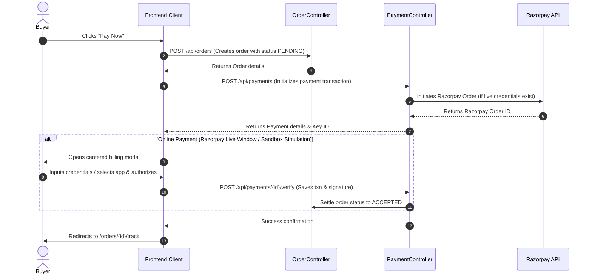

# Customer Payment Experience Improvement Report

This document outlines the design, implementation, and verification details of the improved payment experience in Smart Krishi, introducing direct checkout capabilities.

---

## 1. Objectives & Enhancements

- **Direct Payment Action**: Replaced the multi-step `"Place Order & Pay"` button on the checkout page with a single, direct `"Pay Now"` action.
- **Direct Centered Modal**: Opening the checkout billing gateway directly displays the centered interactive payment selections.
- **Removed Mismatch Options**: Ensured that customers directly pay using their active accounts rather than having to set up/register card tokens or go through an `"Add Payment Method"` setup step.
- **Explicit Options**: Clearly categorized standard billing selections:
  *   **UPI Apps** (with instant request trigger deep link selection for Google Pay, PhonePe, Paytm, BHIM, Amazon Pay)
  *   **Credit Card** (direct credentials entry form)
  *   **Debit Card** (direct credentials entry form)
  *   **Net Banking** (direct bank integration selection for major commercial banks)
  *   **Wallet** (associated digital wallet selection)
  *   **Cash On Delivery (COD)** & **Bank Transfer** (if enabled by administrative configurations)

---

## 2. Interface Implementation Details

### Checkout Page Integration
In [Checkout.jsx](file:///PROJECT_ROOT/frontend/src/Pages/Checkout.jsx), the button was simplified to initiate checkout and open the payment gateway immediately:
```diff
               <button
                 onClick={handleInitiateOrder}
                 disabled={orderLoading || !selectedAddress || !previewTotals}
                 className={`w-full py-4 rounded-2xl text-white font-extrabold shadow-lg flex items-center justify-center gap-2 transition duration-300 ${
                   orderLoading || !selectedAddress || !previewTotals
                     ? "bg-gray-200 text-gray-400 shadow-none cursor-not-allowed"
                     : "bg-emerald-600 hover:bg-emerald-700 shadow-emerald-100/50"
                 }`}
               >
                 {orderLoading && <RefreshCw size={16} className="animate-spin" />}
-                Place Order & Pay
+                Pay Now
               </button>
```

### Centered Payment Modal Tabs
In [PaymentModal.jsx](file:///PROJECT_ROOT/frontend/src/components/PaymentModal.jsx), the options were restructured to separate Credit Card and Debit Card as direct options, updating their titles and labels accordingly:
```diff
                 {/* Tabs Split */}
-                <div className="grid grid-cols-3 gap-2 mt-6">
+                <div className="grid grid-cols-2 md:grid-cols-3 gap-2 mt-6">
                   {[
-                    { id: "UPI", label: "UPI", icon: Smartphone },
-                    { id: "CARD", label: "Cards", icon: CreditCard },
-                    { id: "NETBANKING", label: "NetBanking", icon: Landmark },
-                    { id: "WALLET", label: "Wallets", icon: Wallet },
+                    { id: "UPI", label: "UPI Apps", icon: Smartphone },
+                    { id: "CREDIT_CARD", label: "Credit Card", icon: CreditCard },
+                    { id: "DEBIT_CARD", label: "Debit Card", icon: CreditCard },
+                    { id: "NETBANKING", label: "Net Banking", icon: Landmark },
+                    { id: "WALLET", label: "Wallet", icon: Wallet },
                     ...(config.codEnabled ? [{ id: "COD", label: "COD", icon: CheckCircle }] : []),
                     ...(config.bankTransferEnabled ? [{ id: "BANK_TRANSFER", label: "Bank Transfer", icon: Landmark }] : [])
                   ].map(tab => {
```

Both Credit and Debit Card options open a direct secure credentials form, prompting for card number, expiry, CVV, and cardholder name, eliminating any nested profile setup steps.

---

## 3. Backend Settle & Verification Mechanics

The billing flow coordinates seamlessly across order, payment, and inventory management services on the Spring Boot backend:



### Key Components Verified

1.  **Razorpay Integration**:
    *   **Backend**: `PaymentServiceImpl.java` initializes the `RazorpayClient` utilizing `razorpay.key-id` and `razorpay.key-secret`.
    *   **SDK Order Creation**: Multiplies the order amount by 100 to convert to paise (long value) and posts it to the Razorpay `/orders` API to generate the authentic `razorpayOrderId`.
    *   **Frontend**: Loads the secure Razorpay script (`https://checkout.razorpay.com/v1/checkout.js`) dynamically, initializing the payment window.
2.  **Order Creation & Safety**:
    *   Orders are created in `PENDING` status prior to payment authorization to prevent session loss or orphaned payments.
3.  **Payment Verification (Cryptographic)**:
    *   On completion, the payment details (signature, payment ID, order ID) are validated in `PaymentServiceImpl.java` using HMAC-SHA256 signature verification:
      ```java
      boolean isValid = verifyRazorpaySignature(payment.getRazorpayOrderId(), transactionId, signature);
      ```
    *   Protects against replay attacks by verifying that `transactionId` has not been used in any previously successful payment.
4.  **Payment Failures Handling**:
    *   In the event of network termination or signature verification failure, the payment record status is updated to `FAILED`, the `failureReason` is logged, and the customer is notified without compromising order records.
5.  **Success Settle Flow**:
    *   Settle transition updates payment status to `SUCCESS` and updates the associated order status to `ACCEPTED`.
6.  **Inventory Deductions (Race-Condition Protected)**:
    *   Inventory level checks and quantity deductions are executed atomically during order creation within a database transaction boundary (`OrderServiceImpl.java`):
      ```java
      ProductInventory inventory = product.getInventory();
      int updatedQty = inventory.getQuantityAvailable() - item.getQuantity();
      if (updatedQty < 0) {
          throw new BadRequestException("Insufficient stock for product: " + product.getProductName());
      }
      inventory.setQuantityAvailable(updatedQty);
      inventory.setQuantitySold(inventory.getQuantitySold() + item.getQuantity());
      ```
