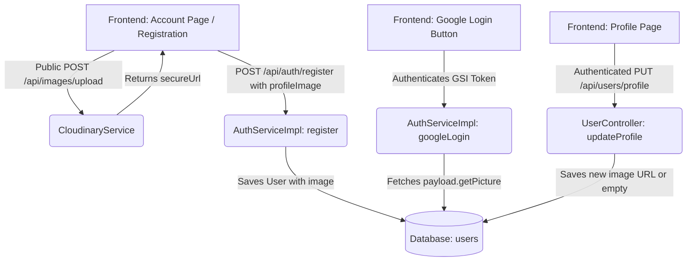

# Profile Photo Support Feature Report

This document outlines the architecture, implementation, and verification guidelines of the Profile Photo Support system in Smart Krishi.

---

## 1. Feature Specifications

- **Email Registration**:
  - Unregistered users can upload a profile photo directly during registration.
  - Users can preview, remove, or replace the photo before submitting the form.
  - Photos are uploaded to **Cloudinary** and stored as a secure HTTPS URL.
  - If no photo is selected, the system defaults to a premium initials-based avatar fallback.
- **Google Login**:
  - The authentication system automatically extracts the Google profile photo (`picture` claim from Google ID Token).
  - The photo is saved as the user's active profile image upon Google sign-in.
- **Profile Customization**:
  - Authenticated users can navigate to their Account Profile page to:
    *   **Keep Google photo**: Retain the linked Google avatar.
    *   **Replace photo**: Upload a new custom picture to Cloudinary to override the current image.
    *   **Remove photo**: Clear the profile photo to revert to the default initials avatar.

---

## 2. Architecture & Service Coordinates



### Backend Components

1.  **RegisterRequest DTO Extension**:
    Added the optional `profileImage` field to [RegisterRequest.java](file:///PROJECT_ROOT/backend/src/main/java/com/smartkrishi/dto/auth/RegisterRequest.java) to accept photo URLs during registration.
2.  **User Entity Mapping**:
    Updated the `register` method in [AuthServiceImpl.java](file:///PROJECT_ROOT/backend/src/main/java/com/smartkrishi/service/auth/AuthServiceImpl.java) to map the DTO's `profileImage` directly to the `User` entity before saving.
3.  **Google Picture Fetching**:
    Ensured `googleLogin` in `AuthServiceImpl.java` extracts and stores the Google avatar:
    ```java
    user.setProfileImage(payload.getPicture());
    ```
4.  **Public Photo Upload Permissions**:
    Configured [SecurityConfig.java](file:///PROJECT_ROOT/backend/src/main/java/com/smartkrishi/config/SecurityConfig.java) to allow public access to `/api/images/upload` so new users can upload photos during sign-up before authentication.
5.  **Cloudinary Service integration**:
    Used the existing `CloudinaryServiceImpl.java` to handle uploads, which automatically converts files into secure Cloudinary CDN links.

---

## 3. Frontend Implementation Details

- **Sign Up Form integration**:
  Integrated a secure file-selector inside the registration form of [Account.jsx](file:///PROJECT_ROOT/frontend/src/Pages/Account.jsx) positioned above the name input fields. Features real-time state management (`profileImage`, `uploadingImage`) with dynamic upload/remove buttons.
- **Profile Edit Form integration**:
  Updated [ProfileSection.jsx](file:///PROJECT_ROOT/frontend/src/Pages/account/ProfileSection.jsx) to switch the upload destination to the Cloudinary upload endpoint. Added a clean `"Remove"` action button under the profile avatar circle when editing is enabled.
- **Initials Fallback**:
  If the `profileImage` string is empty, the topbar and profile pages automatically fall back to initials rendering (e.g. `user.firstName[0] + user.lastName[0]`).
